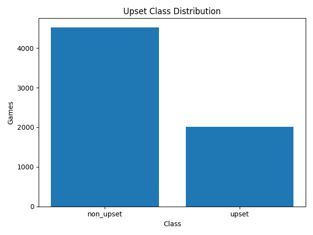
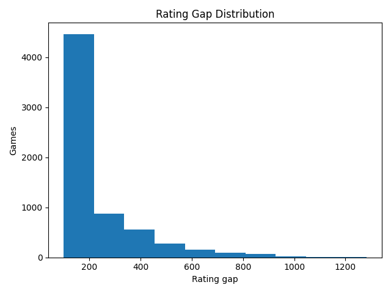
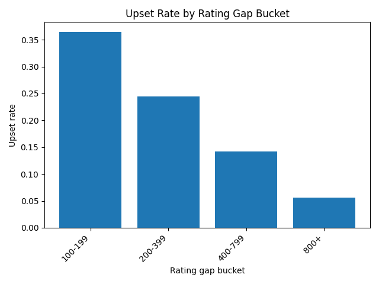
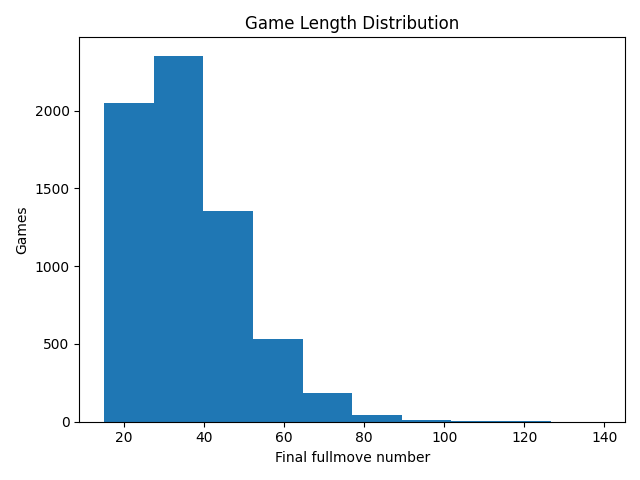
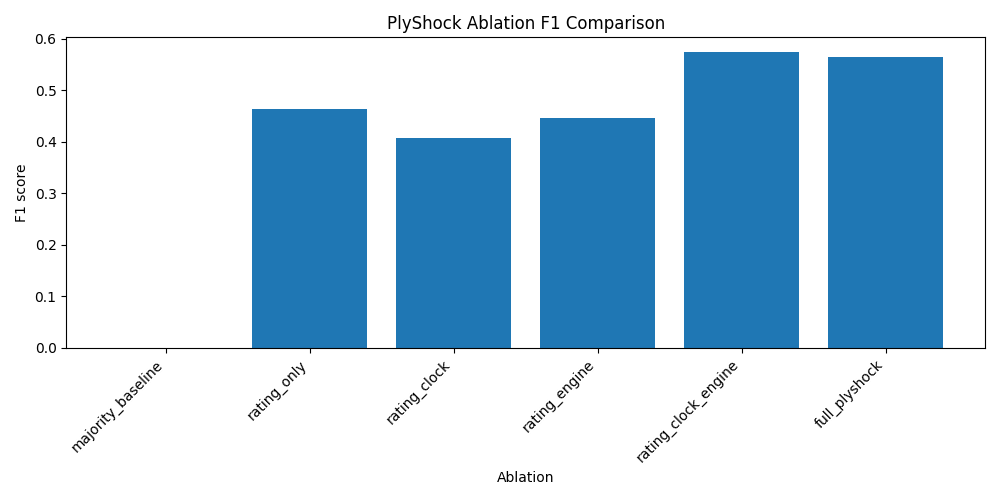
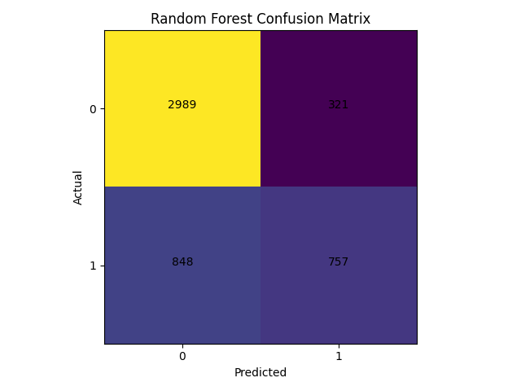
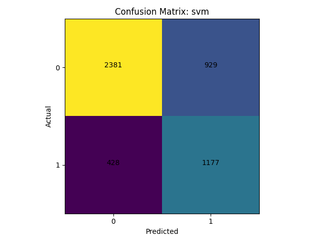
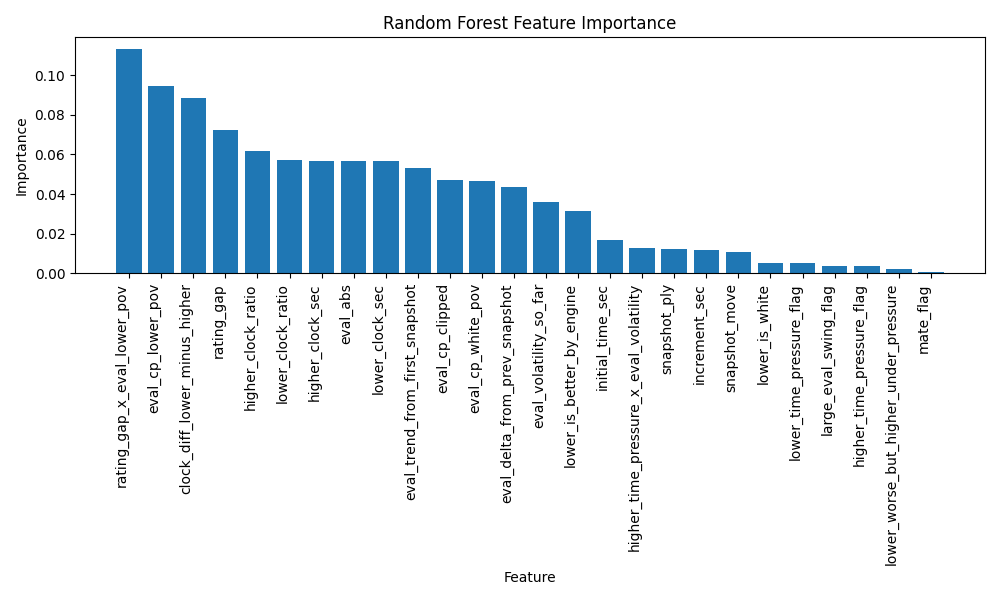

# PlyShock

**Human-Centric Chess Upset Prediction Using Mid-Game Data Mining Features**

PlyShock is a Data Mining / Machine Learning project that predicts whether a chess game is likely to become an upset, where an upset is defined as a lower-rated player defeating a higher-rated opponent.

The project uses real Lichess PGN `.zst` data, extracts mid-game snapshots, evaluates positions with Stockfish, engineers rating/clock/engine/instability features, and compares classical machine learning models such as Decision Tree, KNN, Naive Bayes, SVM, and Random Forest.

---

## Academic Title

**Dynamic Upset Prediction in Chess Using Mid-Game Human-Centric Features**

---

## Problem Statement

Chess results are strongly influenced by player ratings, but lower-rated players still defeat higher-rated opponents under certain dynamic game conditions. These upsets may be linked to mid-game factors such as:

- rating mismatch
- clock pressure
- engine evaluation
- positional instability
- evaluation swings
- interaction effects between rating, time, and position

PlyShock studies whether these mid-game signals can help predict upset outcomes more effectively than rating-only baselines.

---

## Project Scope

This project is designed as a **classical Data Mining project**, not a deep learning chess engine.

Implemented models:

- Decision Tree
- K-Nearest Neighbors
- Naive Bayes
- Support Vector Machine
- Random Forest

The project focuses on interpretable tabular features and avoids CNN/deep-learning-based board modeling as the main implementation.

---

## Dataset

The dataset is built from public Lichess standard rated PGN dumps in `.pgn.zst` format.

The raw `.pgn.zst` file is **not committed** to this repository because of its large size.

### Filtering Criteria

A game is accepted only if it satisfies the project rules:

- decisive result only: `1-0` or `0-1`
- valid `WhiteElo` and `BlackElo`
- rating gap of at least 100
- valid time control
- available clock comments
- reaches at least move 15
- parseable legal move sequence

The target label is:

```text
upset_label = 1 if lower-rated player wins
upset_label = 0 if higher-rated player wins
```

---

## Pipeline Overview

```text
Raw Lichess .pgn.zst
        ↓
Streaming PGN parser
        ↓
Game filtering + upset label creation
        ↓
Mid-game snapshot extraction
        ↓
Stockfish evaluation
        ↓
Feature engineering
        ↓
EDA + model training
        ↓
Evaluation + ablation study
```

---

## Mid-Game Snapshot Strategy

For each accepted game, snapshots are extracted at:

```text
Move 15, 20, 25, 30, 35
```

This creates multiple snapshot rows per game while preserving the same final upset label. The train/test split is grouped by `game_id` so that snapshots from the same game do not appear in both training and testing sets.

---

## Feature Families

The final feature dataset contains 26 model input features grouped into the following families.

### Rating Features

- rating gap
- lower-rated player color

### Clock Features

- lower-rated player remaining time
- higher-rated player remaining time
- clock difference
- clock ratios
- time-pressure flags

### Engine Evaluation Features

- Stockfish centipawn evaluation
- evaluation from lower-rated player perspective
- absolute evaluation
- lower-rated player better/worse flag
- mate flag

### Instability Features

- evaluation delta from previous snapshot
- trend from first snapshot
- volatility so far
- large evaluation swing flag

### Interaction Features

- rating gap × lower-rated evaluation
- time pressure × evaluation volatility
- lower-rated player worse while higher-rated player is under pressure

Leakage-prone fields such as result, winner color, final fullmove number, FEN, game ID, and time-control string are not used as model inputs.

---

## EDA Results

The 50k parsed-game sample produced:

```text
Filtered games: 6,537
Upset games: 2,012
Non-upset games: 4,525
Upset rate: 30.78%
Average rating gap: 224.50
```

Upset rate decreased as the rating gap increased:

| Rating Gap Bucket | Upset Rate |
| --- | ---: |
| 100–199 | 36.46% |
| 200–399 | 24.47% |
| 400–799 | 14.19% |
| 800+ | 5.56% |

### EDA Plots









---

## Snapshot Dataset

From the 6,537 filtered games, the snapshot builder produced:

```text
Total snapshot rows: 24,563
Move 15 snapshots: 6,537
Move 20 snapshots: 5,947
Move 25 snapshots: 5,121
Move 30 snapshots: 4,031
Move 35 snapshots: 2,927
```

Every snapshot was evaluated using Stockfish at fixed depth 8.

---

## Model Training Results

Models were trained on 24,563 snapshot rows using a grouped train/test split by `game_id`.

```text
Train rows: 19,648
Test rows: 4,915
Train games: 5,229
Test games: 1,308
Feature count: 26
```

| Model | Accuracy | Precision | Recall | F1 | ROC-AUC |
| --- | ---: | ---: | ---: | ---: | ---: |
| Decision Tree | 0.698 | 0.542 | 0.500 | 0.520 | 0.647 |
| KNN | 0.729 | 0.607 | 0.477 | 0.535 | 0.729 |
| Naive Bayes | 0.707 | 0.559 | 0.482 | 0.517 | 0.727 |
| SVM | 0.724 | 0.559 | 0.733 | 0.634 | 0.810 |
| Random Forest | 0.762 | 0.702 | 0.472 | 0.564 | 0.813 |

### Interpretation

Random Forest achieved the highest accuracy, precision, and ROC-AUC, while SVM achieved the best recall and F1-score. This suggests that Random Forest is more conservative when predicting upsets, while SVM is better at catching a larger proportion of actual upset cases.

---

## Ablation Study

The ablation study compares the full feature set against simpler baselines.

| Feature Set | Accuracy | F1 | ROC-AUC |
| --- | ---: | ---: | ---: |
| Majority Baseline | 0.673 | 0.000 | N/A |
| Rating Only | 0.552 | 0.463 | 0.586 |
| Rating + Clock | 0.696 | 0.408 | 0.698 |
| Rating + Engine | 0.692 | 0.446 | 0.699 |
| Rating + Clock + Engine | 0.762 | 0.574 | 0.811 |
| Full PlyShock | 0.762 | 0.564 | 0.813 |

The strongest performance jump comes from combining rating, clock, and engine-evaluation features. This supports the central project idea that upset prediction benefits from mid-game context rather than rating alone.



---

## Evaluation Plots

### Random Forest Confusion Matrix



### SVM Confusion Matrix



### Random Forest Feature Importance



---

## Repository Structure

```text
PlyShock/
├── docs/
│   └── research/
│       └── literature-notes.md
├── research/
│   ├── artifacts/
│   │   ├── metrics/
│   │   └── plots/
│   ├── data/
│   │   ├── raw/
│   │   ├── interim/
│   │   ├── processed/
│   │   └── samples/
│   ├── src/
│   │   └── plyshock/
│   │       ├── engine/
│   │       ├── evaluation/
│   │       ├── features/
│   │       ├── parsing/
│   │       ├── pipelines/
│   │       └── training/
│   └── tests/
├── pyproject.toml
├── uv.lock
└── README.md
```

---

## Tech Stack

- Python 3.11
- uv
- pandas
- NumPy
- scikit-learn
- python-chess
- zstandard
- Stockfish
- matplotlib
- pytest
- Ruff

---

## Running the Project

Install dependencies:

```bash
uv sync
```

Run tests:

```bash
uv run pytest
```

Run linting:

```bash
uv run ruff check research/src research/tests
```

### Example Pipeline Commands

Build filtered games:

```bash
uv run python -m plyshock.pipelines.build_filtered_games \
  --input research/data/raw/lichess_db_standard_rated_2026-03.pgn.zst \
  --output research/data/interim/filtered_games_50k.parquet \
  --summary research/artifacts/reports/filter_summary_50k.json \
  --max-games 50000
```

Build snapshots:

```bash
uv run python -m plyshock.pipelines.build_snapshots \
  --input research/data/interim/filtered_games_50k.parquet \
  --output research/data/interim/snapshots_50k.parquet \
  --summary research/artifacts/reports/snapshot_summary_50k.json
```

Run engine evaluation:

```bash
uv run python -m plyshock.pipelines.run_engine_eval \
  --snapshots research/data/interim/snapshots_50k.parquet \
  --cache research/data/interim/eval_cache_50k.parquet \
  --output research/data/interim/snapshots_with_eval_50k.parquet \
  --engine-path research/tools/stockfish/stockfish.exe \
  --depth 8
```

Build features:

```bash
uv run python -m plyshock.pipelines.build_features \
  --input research/data/interim/snapshots_with_eval_50k.parquet \
  --output research/data/processed/plyshock_features_50k.parquet \
  --schema research/data/processed/feature_schema_50k.json \
  --summary research/artifacts/reports/feature_summary_50k.json
```

Train models:

```bash
uv run python -m plyshock.pipelines.train_all_models \
  --features research/data/processed/plyshock_features_50k.parquet \
  --schema research/data/processed/feature_schema_50k.json \
  --models-dir research/artifacts/models \
  --metrics-dir research/artifacts/metrics \
  --plots-dir research/artifacts/plots
```

Run ablation study:

```bash
uv run python -m plyshock.pipelines.run_ablation \
  --features research/data/processed/plyshock_features_50k.parquet \
  --schema research/data/processed/feature_schema_50k.json \
  --output-json research/artifacts/metrics/ablation_results_50k.json \
  --output-plot research/artifacts/plots/ablation_f1_50k.png
```

---

## Notes on Ignored Files

The following files are intentionally not committed:

- raw Lichess `.pgn.zst` dumps
- interim parquet datasets
- processed parquet datasets
- Stockfish binary
- trained `.joblib` models
- local virtual environments
- local editor settings

This keeps the repository lightweight and reproducible.

---

## Current Status

The research pipeline is complete through model evaluation:

```text
Parser ✅
Filtering ✅
EDA ✅
Snapshot extraction ✅
Stockfish evaluation ✅
Feature engineering ✅
Model training ✅
Ablation study ✅
Evaluation plots ✅
```

Planned next stages:

```text
Final report writing
Presentation / viva preparation
FastAPI demo backend
Next.js dashboard frontend
Docker packaging
```

---

## Disclaimer

The reported results are based on a sampled subset of Lichess games and should be interpreted as project-level experimental findings, not universal claims about all chess games. Further validation on additional months, larger samples, and different time controls would strengthen generalization.
